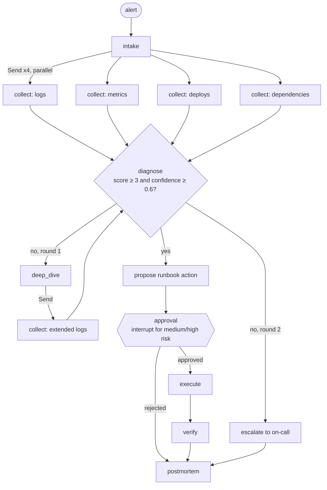

# Incident Copilot

**A LangGraph incident-response workflow.** Evidence is collected in parallel, a human approves any risky fix, runs survive process restarts, and past decisions can be replayed. It's evaluated on simulated incidents against the "alert name → runbook" reflex.

[](LICENSE)
[](pyproject.toml)

On-call engineers get paged with an alert name, and the alert name often points at the wrong cause. A latency alert can be database pool exhaustion. An error-rate alert that fires right after a deploy can be an upstream outage that started *before* that deploy. This project builds the workflow a careful engineer follows, as an explicit, inspectable LangGraph graph:

1. Gather evidence from every source at once.
2. Weigh it, including evidence *against* a hypothesis.
3. Dig deeper when the evidence is unclear.
4. Ask a human before doing anything risky.
5. Verify the fix worked.
6. Write the postmortem.

## Measured result

| Metric | LangGraph agent | Alert-name baseline |
|---|---:|---:|
| Root-cause accuracy | 100% | 40% |
| Remediation accuracy | 100% | 40% |
| Incidents resolved (of 10; 1 should escalate) | 9 | 4 |
| Wrong actions executed in prod | 0 | 6 |
| Medium/high-risk actions run without human approval | 0 | 6 |

Workflow guarantees covered by the local test suite:

- **Rejection:** 6/6 human rejections stopped execution.
- **Durability:** 6/6 paused runs resumed with an identical postmortem after the SQLite checkpoint store was closed and reopened by a fresh graph instance.
- **Time travel:** forking an approved run at its approval checkpoint with "reject" gives a rejected branch, and the original resolved branch stays in history.

These numbers come from `python -m incident_copilot.evals` ([report](results/eval_report.md), [JSON](results/eval_report.json), [all 10 postmortems](results/postmortems/)). Run the evaluation locally to reproduce them; `scripts/compare_results.py` checks a fresh report against the checked-in results.

**Scope warning:** the 10 incidents are simulated. I wrote them with deliberate traps: misleading alert names, a decoy deploy, a quiet log window that needs a deep dive, and one incident with no conclusive signal. They were written alongside the evidence rules, so the 100% is a regression baseline, not proof that the system generalizes to your production telemetry. What carries over is the graph design: fan-out, weighted and cited evidence, confidence gates, approval interrupts, and durable, replayable state.

## The graph



| LangGraph feature | Where | What it's used for |
|---|---|---|
| `Send` map-reduce fan-out | [`graph.py`](src/incident_copilot/graph.py) `fan_out` | Runs four evidence collectors in one superstep and merges their results with an `operator.add` reducer |
| Conditional routing and loop | `route_after_diagnose` | A confidence gate that either accepts, runs one bounded deep dive, or escalates |
| `interrupt()` / `Command(resume=...)` | `approval` node | Pauses with the question and the supporting evidence; a human answers later, possibly from another process |
| `SqliteSaver` checkpointer | [`runtime.py`](src/incident_copilot/runtime.py) | A paused run lives in SQLite: `run` in one process, `resume` in another |
| `get_state_history` / `update_state` | `runtime.history`, `runtime.fork` | Audits every step, and replays a decision by forking from an earlier checkpoint |

Evidence is **cited and signed** ([`diagnostics.py`](src/incident_copilot/diagnostics.py)). Every item names its source line or metric, and can count *against* a cause. For example, "this deploy happened after symptoms began" gives −1.5 to `bad_deploy`. The agent never sees ground truth: `simulator.load()` strips it, and a test enforces that.

## Try it

```bash
python -m venv .venv && source .venv/bin/activate
pip install -e '.[dev]'

incident-copilot list
incident-copilot run INC-002 --thread demo          # pauses: "Approve increase_db_pool (medium risk)?"
incident-copilot resume demo --approve --approver you --note "pool 50->120"   # can be a new shell
incident-copilot history demo                       # every checkpoint
incident-copilot resume demo --reject --from-checkpoint <id of the step with next=['approval']>

pytest -q                                           # 15 tests, including cross-process resume
python -m incident_copilot.evals                    # regenerates results/
```

Optional: set `INCIDENT_COPILOT_LLM=anthropic` (with `pip install -e '.[anthropic]'` and `ANTHROPIC_API_KEY`) to have Claude rephrase the postmortem summary. The prompt forbids adding facts. Diagnosis and actions stay deterministic and evidence-based, which is deliberate: a probabilistic model should not decide on its own whether to roll back production.

## Known limitations

- The evidence rules are hand-written patterns and thresholds for 8 cause types. Real telemetry needs connectors (Prometheus, Loki, deploy APIs) and a larger, labelled incident history.
- The simulator decides recovery from ground truth. It stands in for real post-remediation checks.
- The eval approver approves every proposal, so it measures the graph's safety, not a human's judgement.
